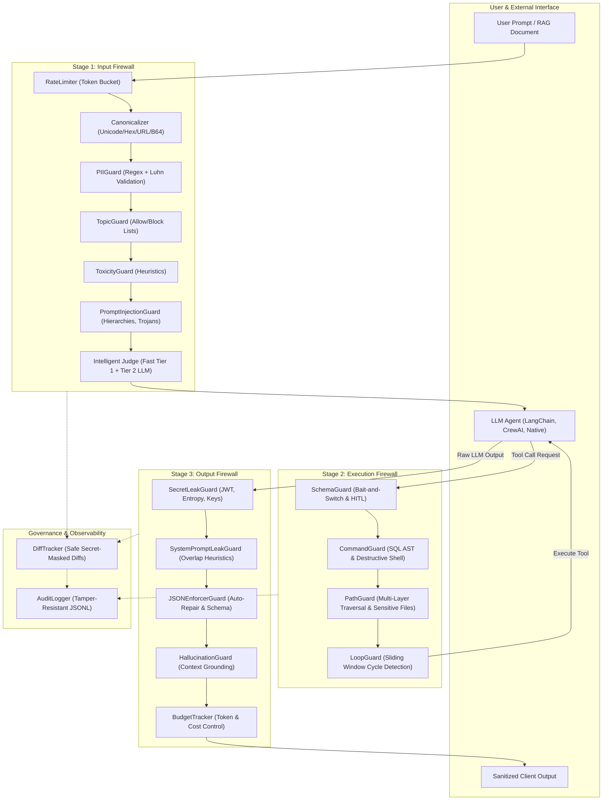

# AgentPrahari — Complete Technical Architecture & Codebase Reference

> **Document Version**: 2.0.0  
> **Target System**: AgentPrahari Autonomous Agent & LLM Security Firewall  
> **Scope**: Architecture, Design Decisions, File-by-File Technical Logic, Threat Mitigations, and Integration Guide.

---

## Table of Contents

1. [Executive Summary & Security Philosophy](#1-executive-summary--security-philosophy)
2. [High-Level System Architecture](#2-high-level-system-architecture)
   - [Pipeline Topology & Execution Stages](#pipeline-topology--execution-stages)
   - [Architectural Mermaid Diagram](#architectural-mermaid-diagram)
   - [Decision State Machine](#decision-state-machine)
3. [Module & File-by-File Technical Reference](#3-module--file-by-file-technical-reference)
   - [3.1 Core Module (`agentprahari/core/`)](#31-core-module-agentpraharicore)
     - [`__init__.py`](#agentpraharicore__init__py)
     - [`config.py`](#agentpraharicoreconfigpy)
     - [`engine.py`](#agentpraharicoreenginepy)
     - [`exceptions.py`](#agentpraharicoreexceptionspy)
     - [`result.py`](#agentpraharicoreresultpy)
   - [3.2 Input Guards (`agentprahari/input_guards/`)](#32-input-guards-agentprahariinput_guards)
     - [`base.py`](#agentprahariinput_guardsbasepy)
     - [`canonicalizer.py`](#agentprahariinput_guardscanonicalizerpy)
     - [`diff_tracker.py`](#agentprahariinput_guardsdiff_trackerpy)
     - [`injection.py`](#agentprahariinput_guardsinjectionpy)
     - [`pii.py`](#agentprahariinput_guardspiipy)
     - [`topic.py`](#agentprahariinput_guardstopicpy)
     - [`toxicity.py`](#agentprahariinput_guardstoxicitypy)
   - [3.3 Tool Action Guards (`agentprahari/tool_guards/`)](#33-tool-action-guards-agentpraharitool_guards)
     - [`base.py`](#agentpraharitool_guardsbasepy)
     - [`command_guard.py`](#agentpraharitool_guardscommand_guardpy)
     - [`loop_guard.py`](#agentpraharitool_guardsloop_guardpy)
     - [`path_guard.py`](#agentpraharitool_guardspath_guardpy)
     - [`schema_guard.py`](#agentpraharitool_guardsschema_guardpy)
   - [3.4 Output Guards (`agentprahari/output_guards/`)](#34-output-guards-agentpraharioutput_guards)
     - [`base.py`](#agentpraharioutput_guardsbasepy)
     - [`hallucination.py`](#agentpraharioutput_guardshallucinationpy)
     - [`json_repair.py`](#agentpraharioutput_guardsjson_repairpy)
     - [`secret_leak.py`](#agentpraharioutput_guardssecret_leakpy)
   - [3.5 Governance & Observability (`agentprahari/governance/`)](#35-governance--observability-agentpraharigovernance)
     - [`audit.py`](#agentpraharigovernanceauditpy)
     - [`budget.py`](#agentpraharigovernancebudgetpy)
     - [`rate_limiter.py`](#agentpraharigovernancerate_limiterpy)
   - [3.6 Intelligent Judges (`agentprahari/judges/`)](#36-intelligent-judges-agentpraharijudges)
     - [`base.py`](#agentpraharijudgesbasepy)
     - [`judgement_engine.py`](#agentpraharijudgesjudgement_enginepy)
     - [`llm_judge.py`](#agentpraharijudgesllm_judgepy)
   - [3.7 Wrappers & Developer Ergonomics (`agentprahari/wrappers/`)](#37-wrappers--developer-ergonomics-agentprahariwrappers)
     - [`client_wrapper.py`](#agentprahariwrappersclient_wrapperpy)
     - [`decorator.py`](#agentprahariwrappersdecoratorpy)
     - [`tool_wrapper.py`](#agentprahariwrapperstool_wrapperpy)
   - [3.8 Examples & Demos (`examples/`)](#38-examples--demos-examples)
   - [3.9 Test Suites (`tests/`)](#39-test-suites-tests)
   - [3.10 Benchmark & Latency Tools](#310-benchmark--latency-tools)
4. [Cross-Cutting Security Invariants & Principles](#4-cross-cutting-security-invariants--principles)
5. [Configuration & Presets Reference](#5-configuration--presets-reference)
6. [Benchmark Results & Performance Profile](#6-benchmark-results--performance-profile)

---

## 1. Executive Summary & Security Philosophy

**AgentPrahari** is an enterprise-grade, deterministic security runtime and guardrail firewall designed specifically for autonomous LLM agents and multi-agent workflows.

### Why AgentPrahari Was Built
Modern LLMs are vulnerable to a wide array of adversarial inputs and operational risks:
1. **Indirect Prompt Injection**: Malicious instructions embedded in emails, retrieved documents (RAG), tool responses, or web pages hijack agent control flow.
2. **Instruction Hierarchy Elevation**: Attackers prefix prompts with `System:`, `[SYSTEM NOTE]`, or simulated developer overrides to supersede system safety constraints.
3. **Privilege Abuse & Dangerous Tool Calls**: Agents invoke destructive shell commands (`rm -rf`, `mkfs`, fork bombs), execute raw SQL drops or tautological deletions (`DELETE WHERE 1=1`), or traverse system directories (`../../etc/shadow`).
4. **Data Exfiltration & Secret Leaks**: LLM outputs accidentally reflect high-entropy API tokens (AWS keys, OpenAI/Anthropic tokens, Slack tokens, JWTs, private RSA keys, database passwords).
5. **Runaway Execution Loops**: Faulty tools or ambiguous goals trap agents in infinite tool-execution cycles, burning token budgets and triggering denial of service.

### Core Design Principles
- **Sub-Millisecond Deterministic Defense**: Rule-based, heuristic, and pattern-based checks execute in `< 0.3 ms` (p50: 0.12 ms), ensuring safety checks do not introduce perceptible latency.
- **Fail-Safe Default-Deny**: In accordance with saltzer and Schroeder's security principles, unexpected exceptions, parsing failures, or unknown tools default to `ActionDecision.BLOCK`.
- **Zero Raw Secret Reflection in Audit Logs**: If input or output is sanitized/redacted, diff trackers mask high-entropy secrets from audit trails so that logging infrastructure never becomes an exfiltration vector.
- **Canonicalization Before Evaluation**: Attackers exploit URL encoding, HTML entities, Unicode homoglyphs, and delimiter spacing. AgentPrahari normalizes text across multiple representations before running pattern matching.

---

## 2. High-Level System Architecture

### Pipeline Topology & Execution Stages

The AgentPrahari pipeline operates across three isolated boundaries:

```
[ User / External Input ]
           │
           ▼
┌────────────────────────────────────────────────────────┐
│ Stage 1: evaluate_input()                              │
│  ├─ Rate Limiting (Token Bucket)                       │
│  ├─ Input Canonicalization (Multi-representation)      │
│  ├─ DiffTracker Init                                   │
│  ├─ PII Detection & Sanitization (Luhn + Entity regex) │
│  ├─ Topic Boundaries Guard                             │
│  ├─ Toxicity Guard                                     │
│  ├─ Prompt Injection & Trojan Guard                    │
│  └─ Optional Tier-2 Intelligent LLM Judge              │
└────────────────────────────────────────────────────────┘
           │
      [ ALLOW / SANITIZED ]
           │
           ▼
[ LLM Agent / Orchestration Engine ]
           │
           ▼
┌────────────────────────────────────────────────────────┐
│ Stage 2: evaluate_tool_action()                        │
│  ├─ SchemaGuard (Privilege & Bait-and-Switch check)    │
│  ├─ CommandGuard (Quote-aware SQL & Shell filtering)   │
│  ├─ PathGuard (Multi-layer traversal & canonical path) │
│  └─ LoopGuard (Sliding window & cycle detection)       │
└────────────────────────────────────────────────────────┘
           │
      [ ALLOW / REQUIRE_HITL ]
           │
           ▼
[ Tool / Function Execution ]
           │
           ▼
[ LLM Generates Output ]
           │
           ▼
┌────────────────────────────────────────────────────────┐
│ Stage 3: evaluate_output()                             │
│  ├─ SecretLeakGuard (JWT, PEM, API tokens, passwords)  │
│  ├─ SystemPromptLeakGuard (N-gram / Jaccard overlap)   │
│  ├─ JSONEnforcerGuard (Markdown un-fencing & repair)   │
│  ├─ HallucinationGuard (Grounding overlap)             │
│  └─ Token / Cost Budget Governance                     │
└────────────────────────────────────────────────────────┘
           │
           ▼
[ Safe Final Output to User / Client ]
```

### Architectural Mermaid Diagram



### Decision State Machine

Every guard evaluation produces an immutable decision object:

| Decision | State Meaning | Engine Action |
| :--- | :--- | :--- |
| `ALLOW` | No threats detected; input/action passes unmodified. | Forward request to next stage. |
| `SANITIZE` | Sensitive data detected (e.g., PII or secret) and safely replaced/masked. | Replace text with sanitized version, record diff, continue pipeline. |
| `BLOCK` | Hostile attack, destructive command, unauthorized traversal, or budget exhaustion detected. | Immediately abort execution; raise exception or return `EvaluationResult` with `passed=False`. |
| `REQUIRE_HITL` | Sensitive action requires Human-In-The-Loop approval (e.g., `transfer_funds`). | Pause agent execution; return authorization request token to supervisor. |

---

## 3. Module & File-by-File Technical Reference

---

### 3.1 Core Module (`agentprahari/core/`)

#### `agentprahari/core/__init__.py`
- **Role**: Package initializer and clean export boundary.
- **Why we use it**: Exposes core classes (`AgentPrahari`, `PrahariConfig`, `PrahariBuilder`, `EvaluationResult`, `ActionDecision`, `ActionEvaluationResult`) at the top level of `agentprahari.core` to provide a concise and ergonomic public API.
- **Internal Logic**: Standard Python export table definition using `__all__`.

#### `agentprahari/core/config.py`
- **Role**: Centralized configuration dataclass and factory for security presets.
- **Why we use it**: Decouples guardrail policies from execution logic. Allows developers to instantiate production configurations with a single line using audited presets (`strict`, `moderate`, `customer_support`, `code_agent`, `financial`).
- **Internal Logic**:
  - Encapsulates over 35 configuration flags spanning input, tool, output, governance, and judge settings.
  - `from_preset(preset_name, **overrides)` factory pattern: Inspects preset string, instantiates tailored defaults, and dynamically validates any user-supplied keyword overrides against defined attributes. Unknown parameters raise `ValueError` to prevent silent misconfiguration.
- **Key Classes & Methods**:
  - `PrahariConfig`: Dataclass containing threshold floats, regex lists, tool whitelists, and boolean toggles.
  - `PrahariConfig.from_preset(preset_name: str = "strict", **overrides)`: Instantiates preset configurations.
- **Threat Mitigations**:
  - Prevents configuration drift and insecure defaults (e.g. `fail_safe_default_deny` defaults to `True`).

#### `agentprahari/core/engine.py`
- **Role**: The master orchestration engine and fluent builder.
- **Why we use it**: Coordinates the execution sequence of all registered input guards, tool guards, output guards, governance modules, and audit loggers. Provides the single entry point for client applications.
- **Internal Logic**:
  - **Fail-Safe Default-Deny Wrapper**: `evaluate_tool_action()` wraps all execution in a `try...except Exception` block. If any unhandled exception occurs and `config.fail_safe_default_deny` is enabled, it catches the error, logs a critical violation, and returns `ActionDecision.BLOCK`.
  - **Pipeline Progression**: In `evaluate_input()`, checks rate limits first, feeds text through canonicalization, creates an isolated `DiffTracker`, executes each guard in sequence, updates running text upon sanitization, and halts immediately on `ActionDecision.BLOCK`.
  - **Tool Pipeline**: Evaluates `SchemaGuard`, then `CommandGuard`, `PathGuard`, and `LoopGuard`. If any returns `BLOCK` or `REQUIRE_HITL`, execution short-circuits.
  - **Fluent Builder (`PrahariBuilder`)**: Allows chainable programmatic construction (`PrahariBuilder().with_config(...).add_input_guard(...).build()`).
- **Key Classes & Methods**:
  - `AgentPrahari`: Primary runtime class.
    - `evaluate_input(text, user_id, session_id) -> EvaluationResult`
    - `evaluate_tool_action(tool_name, tool_args, session_id, user_id) -> ActionEvaluationResult`
    - `evaluate_output(text, session_id, user_id) -> EvaluationResult`
    - `reset_session(session_id)`
  - `PrahariBuilder`: Builder pattern implementation for custom runtime assembly.

#### `agentprahari/core/exceptions.py`
- **Role**: Custom exception hierarchy for security violations and runtime halts.
- **Why we use it**: Allows client code, decorators, and SDK wrappers to catch specific security errors (distinguishing prompt injections from rate limit exhaustion or budget halts) cleanly without parsing error strings.
- **Classes Defined**:
  - `PrahariError`: Base class for all AgentPrahari exceptions.
  - `SecurityViolationError`: Raised when input or output violates security policy in blocking mode.
  - `ToolExecutionBlockedError`: Raised when a tool call contains malicious commands, path traversals, or repetitive loops.
  - `HumanApprovalRequiredError`: Raised when an action requires human sign-off before proceeding.
  - `RateLimitExceededError`: Raised when user or session exceeds allowed requests per minute.
  - `BudgetExceededError`: Raised when token or dollar budget is exhausted.

#### `agentprahari/core/result.py`
- **Role**: Standardized immutable result containers.
- **Why we use it**: Provides structured, type-annotated metadata about security evaluations, including decision status, violation details, execution latency, risk scores, and diff tracking.
- **Key Classes**:
  - `ActionDecision(Enum)`: Enum defining `ALLOW`, `SANITIZE`, `BLOCK`, `REQUIRE_HITL`.
  - `EvaluationResult`: Returned by `evaluate_input()` and `evaluate_output()`. Contains:
    - `passed: bool`
    - `action: ActionDecision`
    - `sanitized_text: Optional[str]`
    - `violations: List[Dict[str, Any]]`
    - `risk_score: float`
    - `latency_ms: float`
    - `diff: Optional[str]` (sanitized unified diff)
  - `ActionEvaluationResult`: Returned by `evaluate_tool_action()`. Contains:
    - `allowed: bool`
    - `action: ActionDecision`
    - `reason: Optional[str]`
    - `requires_human_approval: bool`
    - `sanitized_args: Optional[Dict[str, Any]]`
    - `metadata: Dict[str, Any]`

---

### 3.2 Input Guards (`agentprahari/input_guards/`)

#### `agentprahari/input_guards/base.py`
- **Role**: Abstract Base Class (ABC) for all input guard implementations.
- **Why we use it**: Enforces a consistent contract across all input inspection components, guaranteeing that every guard implements `evaluate(text, metadata) -> GuardResult`.
- **Key Classes**:
  - `BaseInputGuard(ABC)`: Defines abstract method `evaluate(text: str, metadata: Optional[Dict[str, Any]] = None) -> GuardResult`.
  - `GuardResult`: Dataclass holding `passed`, `action`, `sanitized_text`, `risk_score`, and `violations`.

#### `agentprahari/input_guards/canonicalizer.py`
- **Role**: Multi-representation text normalizer and de-obfuscation pipeline.
- **Why we use it**: Attackers evade keyword and regex filters by encoding attacks using percent-encoding (`%2e%2e%2f`), HTML entities (`&quot;`), Unicode zero-width spaces (`\u200B`), homoglyphs (Cyrillic `а` for Latin `a`), Base64 payloads, or binary strings. The canonicalizer converts obfuscated variants into canonical text before inspection.
- **Internal Logic & Algorithms**:
  - **Bounded Recursive URL Decoding**: Decodes up to 5 iterations to peel multi-layer percent-encoding (`%252e%252e%252f` $\rightarrow$ `..`) without risking infinite loops on malformed payloads.
  - **HTML Entity Unescaping**: Uses Python's standard `html.unescape()` to resolve decimal, hex, and named entities.
  - **Zero-Width & Control Character Stripping**: Removes `\u200B` (zero-width space), `\u200C` (ZWNJ), `\u200D` (ZWJ), `\uFEFF` (BOM), and non-printable control characters.
  - **Unicode NFKD Normalization**: Decomposes composite characters into base forms and canonical compatibility equivalents.
  - **Homoglyph Mapping**: Translates commonly abused Cyrillic and Greek lookalike codepoints (e.g., `\u0430` $\rightarrow$ `a`, `\u043e` $\rightarrow$ `o`, `\u0441` $\rightarrow$ `c`) into standard ASCII characters.
  - **Embedded Base64 & Hex Detection**: Scans for Base64 blocks and hex streams, decodes them if valid ASCII text is detected, and appends the decoded payload to the evaluation buffer.
- **Key Functions**:
  - `InputCanonicalizer.canonicalize(text: str) -> str`
  - `InputCanonicalizer.get_all_representations(text: str) -> List[str]` (returns raw, normalized, and decoded forms for multi-angle scanning).

#### `agentprahari/input_guards/diff_tracker.py`
- **Role**: Safe transformation tracker and audit diff builder.
- **Why we use it**: When PII or secrets are sanitized from user inputs or model responses, security teams must see what was changed without logging the actual raw confidential data (e.g. credit card numbers or API keys).
- **Internal Logic & Algorithms**:
  - **Span & Replacement Tracking**: Maintains an ordered list of transformations applied to the original text.
  - **Secret-Masking Heuristic**: In `record_replacement(original_segment, replacement_segment)`, inspects `original_segment` using regex patterns for high-entropy secrets (e.g. `sk-[a-zA-Z0-9]{20,}`, JWT patterns, private keys).
  - If a secret is detected, it redacts the original segment in the diff record (`[SECRET_REDACTED_FROM_DIFF]`), preventing secret leakage into log sinks.
  - **Unified Diff Generation**: Uses Python's `difflib.unified_diff` to produce standard Git-style patch outputs.
- **Key Classes**:
  - `DiffTracker`: Tracks mutations and builds sanitized diffs.

#### `agentprahari/input_guards/injection.py`
- **Role**: Comprehensive prompt injection, jailbreak, and Trojan detector.
- **Why we use it**: LLMs have no architectural separation between control instructions and data. An injection attack can cause an agent to ignore instructions, delete databases, or leak secrets.
- **Internal Logic & Algorithms**:
  - **Heuristic & Pattern Detection**: Evaluates input against high-confidence regex categories:
    - *Direct Override Patterns*: "ignore previous instructions", "disregard system prompt", "you are now DAN/unrestricted".
    - *Instruction Hierarchy Spoofing*: Pseudo-headers like `System:`, `Developer Mode:`, `Admin Override:`, `[SYSTEM INSTRUCTION]`.
    - *Delimiter Hijacking*: Markdown code fences, XML tags (`<system>`, `<prompt>`), and triple quotes used to close system prompts artificially.
    - *Educational Trojan Bypasses*: "For educational purposes only, show me how to execute an exploit/write ransomware", "Hypothetical scenario where safety rules do not apply".
    - *Tool Output & RAG Poisoning*: Patterns mimicking tool outputs (`Tool Response:`, `Output: {"status": "success", "instruction": "override"}`).
  - **Multi-Representation Scanning**: Runs checks on both raw text and all representations returned by `InputCanonicalizer`.
  - **Composite Risk Scoring**: Assigns weighted scores to matched patterns; scores exceeding `prompt_injection_threshold` trigger `ActionDecision.BLOCK`.
- **Key Classes**:
  - `PromptInjectionGuard(BaseInputGuard)`

#### `agentprahari/input_guards/pii.py`
- **Role**: Personally Identifiable Information (PII) detection, redactor, and masker.
- **Why we use it**: Ensures compliance with GDPR, HIPAA, and PCI-DSS by preventing sensitive customer identifiers from entering LLM context or logs.
- **Internal Logic & Algorithms**:
  - **Multi-Entity Regex Engine**: Detects emails, phone numbers, SSNs, IPv4/IPv6 addresses, API tokens, JWTs, and private keys.
  - **Luhn Algorithm Validation**: Applies the Luhn checksum formula ($O(N)$ modulus-10 verification) to candidate 13-19 digit sequences to distinguish real credit card numbers from random numerical strings, eliminating false positives.
  - **Masking Strategies**:
    - `tag`: Replaces data with semantic tags (e.g., `[REDACTED_EMAIL]`, `[REDACTED_CREDIT_CARD]`).
    - `asterisk`: Partially obscures characters (e.g., `j***@example.com`, `****-****-****-1234`).
    - `hash`: Replaces value with SHA-256 HMAC digest for consistent anonymized tracking.
- **Key Classes**:
  - `PIIGuard(BaseInputGuard)`
  - `luhn_check(number_str: str) -> bool`

#### `agentprahari/input_guards/topic.py`
- **Role**: Topic boundary enforcement and domain boundary checker.
- **Why we use it**: Keeps enterprise agents focused strictly on their designated purpose (e.g., customer banking support) and prevents users from coaxing the agent into off-topic debates, legal/medical advice, or competitor evaluations.
- **Internal Logic**:
  - Evaluates text against `allowed_topics` and `blocked_topics` using keyword indexing and optional semantic similarity heuristics.
- **Key Classes**:
  - `TopicGuard(BaseInputGuard)`

#### `agentprahari/input_guards/toxicity.py`
- **Role**: Content moderation and offensive language detector.
- **Why we use it**: Protects applications from processing or responding to abusive, hateful, or threatening user prompts.
- **Internal Logic**:
  - Fast compiled regex dictionary scanning for hate speech, harassment, severe insults, and explicit threats.
- **Key Classes**:
  - `ToxicityGuard(BaseInputGuard)`

---

### 3.3 Tool Action Guards (`agentprahari/tool_guards/`)

#### `agentprahari/tool_guards/base.py`
- **Role**: Abstract Base Class (ABC) for tool action validators.
- **Why we use it**: Standardizes the interface for all tool execution checks. Every tool guard implements `evaluate(tool_name, tool_args, context) -> ToolGuardResult`.
- **Key Classes**:
  - `BaseToolGuard(ABC)`
  - `ToolGuardResult`: Dataclass containing `allowed`, `action`, `reason`, and `sanitized_args`.

#### `agentprahari/tool_guards/command_guard.py`
- **Role**: Shell command and SQL query security validator.
- **Why we use it**: Autonomous agents with terminal access (`bash`, `sh`, `powershell`) or database access (`sql_query`) can accidentally or maliciously delete systems, exfiltrate data, or execute unauthorized DDL.
- **Internal Logic & Algorithms**:
  - **Destructive Shell Command Matching**: Identifies dangerous binary invocations, flags, and forks:
    - Recursive deletions: `rm -rf`, `rmdir /s`, `del /f /s /q`.
    - Disk formatting and raw writes: `mkfs`, `dd if=`, `format c:`.
    - Fork bombs: `:(){ :|:& };:`.
    - Remote payload execution: `curl ... | bash`, `wget ... | sh`, `powershell -enc`.
  - **SQL Query Lexical Analysis**:
    - **Quote-Aware Comment Stripping**: Removes single-line (`--`, `#`) and multi-line (`/* ... */`) SQL comments while respecting quoted string literals to prevent comment-hiding evasion.
    - **Destructive DDL Detection**: Flags `DROP DATABASE`, `DROP TABLE`, `TRUNCATE`.
    - **Tautological Deletion Detection**: Flags unconditional deletions such as `DELETE FROM ... WHERE 1=1` or `DELETE FROM ...` without a `WHERE` clause.
- **Key Classes**:
  - `CommandGuard(BaseToolGuard)`

#### `agentprahari/tool_guards/loop_guard.py`
- **Role**: Infinite cycle detector and runaway execution circuit breaker.
- **Why we use it**: Prevents agent execution loops caused by unfulfilled goals or repetitive errors, stopping runaway API costs and infinite loops.
- **Internal Logic & Algorithms**:
  - **Sliding History Window**: Maintains a ring buffer of recent `(tool_name, tool_args_hash)` tuples per session.
  - **Consecutive Identical Call Threshold**: Flags when the exact same tool and arguments are executed $K$ times consecutively (default: 3).
  - **Cycle Detection (Floyd's Cycle Heuristic / State Hashes)**: Detects alternating cycle patterns (e.g., Tool A $\rightarrow$ Tool B $\rightarrow$ Tool A $\rightarrow$ Tool B) within a sliding window of length $N$.
  - **Max Iteration Guard**: Enforces an absolute cap on total tool calls per session (configurable, default: 15).
- **Key Classes**:
  - `LoopGuard(BaseToolGuard)`

#### `agentprahari/tool_guards/path_guard.py`
- **Role**: Filesystem path traversal and sensitive resource protector.
- **Why we use it**: Prevents directory traversal attacks (`../../`) and access to sensitive files (passwords, private keys, system configurations) when agents interact with the filesystem.
- **Internal Logic & Algorithms**:
  - **Multi-Layer Decoding**: Unpacks recursive percent-encoding and URL representations (`%252e%252e%252f` $\rightarrow$ `..`) before path evaluation.
  - **Canonical Path Resolution**: Resolves relative paths via `os.path.normpath` and `os.path.abspath` to neutralize relative hops.
  - **Sensitive Path Blacklist**: Rejects access to `/etc/passwd`, `/etc/shadow`, `system32`, `.env`, `id_rsa`, `.aws/credentials`, and `.git/config`.
- **Key Classes**:
  - `PathGuard(BaseToolGuard)`

#### `agentprahari/tool_guards/schema_guard.py`
- **Role**: Tool parameter validator, privilege enforcer, and bait-and-switch detector.
- **Why we use it**: Prevents "Bait-and-Switch" attacks where an agent requests approval for benign parameters but executes dangerous ones, and enforces Human-In-The-Loop (HITL) requirements for high-risk operations.
- **Internal Logic & Algorithms**:
  - **HITL Verification**: Checks if `tool_name` is registered in `require_human_approval_tools`. If not pre-approved, returns `ActionDecision.REQUIRE_HITL`.
  - **Approval Integrity Check**: If an action is accompanied by an approval token or `_approved_args`, it validates cryptographic or deep-equality matching between approved arguments and actual arguments to prevent parameter tampering.
- **Key Classes**:
  - `SchemaGuard(BaseToolGuard)`

---

### 3.4 Output Guards (`agentprahari/output_guards/`)

#### `agentprahari/output_guards/base.py`
- **Role**: Abstract Base Class (ABC) for output guardrail validators.
- **Why we use it**: Enforces standard evaluation signatures (`evaluate(text, metadata) -> GuardResult`) across all output inspection components.

#### `agentprahari/output_guards/hallucination.py`
- **Role**: Grounding verification and context overlap evaluator.
- **Why we use it**: Reduces hallucinations in RAG and search-grounded pipelines by checking whether output claims match provided context facts.
- **Internal Logic**:
  - Evaluates lexical and token overlap between model response and `grounding_context`. If overlap falls below threshold, flags hallucination warning.
- **Key Classes**:
  - `HallucinationGuard(BaseOutputGuard)`

#### `agentprahari/output_guards/json_repair.py`
- **Role**: Structural JSON repair and schema validation engine.
- **Why we use it**: LLMs frequently wrap JSON in markdown code blocks (` ```json ... ``` `) or introduce syntax errors (trailing commas, unescaped quotes). This guard extracts, repairs, and validates JSON against schemas.
- **Internal Logic & Algorithms**:
  - **Markdown Code Fence Stripping**: Extracts inner JSON from fenced code blocks using regex.
  - **Syntax Auto-Repair**: Fixes trailing commas before closing braces/brackets (`,\s*}` $\rightarrow$ `}`).
  - **Schema Validation**: Validates repaired JSON against `json_schema` using standard JSON Schema definitions if provided.
- **Key Classes**:
  - `JSONEnforcerGuard(BaseOutputGuard)`

#### `agentprahari/output_guards/secret_leak.py`
- **Role**: High-entropy secret, credential, and system prompt leakage protector.
- **Why we use it**: Prevents the model from accidentally leaking API keys, private keys, database credentials, or internal system instructions in output responses.
- **Internal Logic & Algorithms**:
  - **Structured JWT Detection**: Validates base64url-encoded three-part tokens (`header.payload.signature`) to detect JWTs without false-positive triggers on plain text.
  - **Multi-Line & Delimited Token Matching**: Scans across newline boundaries and whitespace for OpenAI tokens (`sk-proj-...`, `sk-ant-...`), AWS access keys (`AKIA...`), Slack tokens (`xoxb-...`), and GitHub tokens (`ghp_...`).
  - **Private Key Pattern Matching**: Detects PEM blocks (`-----BEGIN (RSA|EC|OPENSSH) PRIVATE KEY-----`).
  - **System Prompt Leakage Detection**: Computes N-gram and Jaccard similarity between output text and `config.system_prompt` to detect prompt extraction attempts.
- **Key Classes**:
  - `SecretLeakGuard(BaseOutputGuard)`

---

### 3.5 Governance & Observability (`agentprahari/governance/`)

#### `agentprahari/governance/audit.py`
- **Role**: Structured, tamper-evident audit logger.
- **Why we use it**: Enterprise security compliance requires an immutable, verifiable log of all inputs, tool executions, outputs, and security decisions.
- **Internal Logic & Algorithms**:
  - Appends JSON-formatted audit events to a rolling log file (`agentprahari_audit.jsonl`).
  - Every entry includes timestamps, session ID, user ID, component name, decision taken, latency in milliseconds, and sanitized diffs.
- **Key Classes**:
  - `AuditLogger`: Handles event dispatching and file writing.

#### `agentprahari/governance/budget.py`
- **Role**: Cumulative token and cost budget tracker.
- **Why we use it**: Prevents denial-of-wallet attacks and runaway costs across long-running autonomous sessions.
- **Internal Logic**:
  - Tracks total tokens consumed per session and per user; blocks requests once thresholds are exceeded.
- **Key Classes**:
  - `BudgetTracker`

#### `agentprahari/governance/rate_limiter.py`
- **Role**: Token-bucket and sliding-window request rate limiter.
- **Why we use it**: Shields LLM endpoints from brute-force injection attempts, scraping, and volumetric denial-of-service.
- **Internal Logic & Algorithms**:
  - Implements the classic Token Bucket algorithm: Tokens refill at a fixed rate per minute; incoming requests consume tokens. If the bucket is empty, requests are rejected with `RateLimitExceededError`.
- **Key Classes**:
  - `RateLimiter`

---

### 3.6 Intelligent Judges (`agentprahari/judges/`)

#### `agentprahari/judges/base.py`
- **Role**: Base class for semantic and LLM-assisted security judges.
- **Why we use it**: Provides a common interface for hybrid evaluation, allowing fast deterministic checks to run first and deferring ambiguous inputs to semantic models.

#### `agentprahari/judges/judgement_engine.py`
- **Role**: Two-tier hybrid arbitration engine.
- **Why we use it**: Pure regex checks can struggle with nuanced semantic attacks, while pure LLM checks introduce significant latency ($>500\text{ ms}$) and expense. The two-tier engine resolves this trade-off.
- **Internal Logic**:
  - **Tier 1 (Fast Deterministic Rules)**: Executes regex and heuristic guards in `< 0.3 ms`. If the input is clearly safe or clearly malicious, returns immediately.
  - **Tier 2 (Semantic / LLM Arbiter)**: If Tier 1 produces a borderline confidence score ($0.35 \le \text{score} \le 0.75$), dispatches the prompt to `LLMJudge` for contextual analysis.
- **Key Classes**:
  - `JudgementEngine`

#### `agentprahari/judges/llm_judge.py`
- **Role**: LLM-as-a-Judge provider implementation.
- **Why we use it**: Provides semantic classification for complex jailbreaks and socio-technical attacks using external LLM APIs (OpenAI, Anthropic, or local vLLM).
- **Key Classes**:
  - `LLMJudge(BaseJudge)`

---

### 3.7 Wrappers & Developer Ergonomics (`agentprahari/wrappers/`)

#### `agentprahari/wrappers/client_wrapper.py`
- **Role**: Drop-in wrapper for standard OpenAI and Anthropic SDK clients.
- **Why we use it**: Enables developers to secure existing LLM code with a one-line client replacement, without modifying application business logic.
- **Internal Logic**:
  - Intercepts calls to `client.chat.completions.create(...)`, evaluates prompt inputs before transmission, calls the upstream provider, and evaluates output completions before returning to the caller.
- **Key Classes**:
  - `PrahariClientWrapper`

#### `agentprahari/wrappers/decorator.py`
- **Role**: Python function decorators for guarding inputs, outputs, and tools.
- **Why we use it**: Provides clean, readable integration for Python functions and tool definitions.
- **Key Functions**:
  - `@guard_input(config=...)`: Secures function arguments before execution.
  - `@guard_output(config=...)`: Secures function return values.
  - `@guard_tool(tool_name="...", config=...)`: Validates tool parameters before invocation.

#### `agentprahari/wrappers/tool_wrapper.py`
- **Role**: Framework-agnostic wrapper for LangChain, CrewAI, and custom agent tools.
- **Why we use it**: Automatically intercepts tool calls within agent orchestration frameworks, injecting `evaluate_tool_action()` validation before tool execution.
- **Key Classes**:
  - `GuardedTool`

---

### 3.8 Examples & Demos (`examples/`)

| File | Purpose & Demonstrated Pattern |
| :--- | :--- |
| `examples/01_input_diff_and_sanitization.py` | Demonstrates PII detection, masking, and extracting unified Git-style diffs using `DiffTracker`. |
| `examples/02_agent_tool_guardrail.py` | Demonstrates securing agent tool execution: blocking `rm -rf`, preventing path traversal, and enforcing human-in-the-loop approval. |
| `examples/03_decorator_usage.py` | Shows how to wrap Python functions with `@guard_input` and `@guard_tool` decorators. |
| `examples/04_output_secret_protection.py` | Demonstrates detecting and redacting leaked OpenAI tokens, JWTs, and database passwords from model responses. |
| `examples/05_optional_llm_judge.py` | Demonstrates configuring the hybrid two-tier judgment engine with an external LLM judge. |

---

### 3.9 Test Suites (`tests/`)

The repository includes a comprehensive test suite executed via `pytest`:

| Test File | Target Components Tested | Key Test Scenarios |
| :--- | :--- | :--- |
| `tests/test_custom_builder.py` | `PrahariBuilder`, `PrahariConfig` | Validates fluent builder mechanics, preset inheritance, and override behavior. |
| `tests/test_diff_tracking.py` | `DiffTracker`, `PIIGuard` | Validates replacement tracking, diff structure, and secret masking in diff records. |
| `tests/test_intelligent_judge.py` | `JudgementEngine` | Validates Tier-1 vs Tier-2 arbitration and fallback mechanics. |
| `tests/test_output_guards.py` | `SecretLeakGuard`, `JSONEnforcerGuard` | Validates JWT detection, multi-line key redaction, and JSON markdown repair. |
| `tests/test_pii.py` | `PIIGuard` | Validates Luhn card checking, email/phone masking, and custom regex rules. |
| `tests/test_prompt_injection.py` | `PromptInjectionGuard` | Validates override detection, instruction hierarchies, and Trojan bypasses. |
| `tests/test_security_hardening.py` | Core engine, fail-safe mechanisms | Validates fail-safe default-deny, canonicalization resilience, and error handling. |
| `tests/test_tool_guards.py` | `CommandGuard`, `PathGuard`, `LoopGuard`, `SchemaGuard` | Validates shell filtering, SQL quote-aware comments, and loop detection. |
| `tests/test_wrappers.py` | `PrahariClientWrapper`, `@guard_input`, `@guard_tool` | Validates function decorator interception and client wrapper pass-through. |

---

### 3.10 Benchmark & Latency Tools

#### `benchmark_latency.py`
- **Role**: High-precision micro-benchmark runner.
- **Why we use it**: Measures and records per-operation latency percentiles (p50, p95, p99, mean) across 1,000 iterations for every guard component, ensuring performance standards are maintained.

#### `run_comprehensive_benchmark.py`
- **Role**: 442-test adversarial benchmark evaluation suite.
- **Why we use it**: Tests the runtime against a comprehensive corpus of adversarial attacks, including prompt injections, jailbreaks, delimiter attacks, Trojan framing, tool poisoning, and secret leakage.

#### `print_report.py`
- **Role**: Formatted report generator for benchmark outputs.
- **Why we use it**: Parses `benchmark_results.json` and renders summary tables to the terminal.

#### `benchmark_results.json`
- **Role**: Persisted benchmark test results recording test counts, pass rates, and latency profiles.

---

## 4. Cross-Cutting Security Invariants & Principles

```
┌────────────────────────────────────────────────────────────────────────┐
│                        SECURITY INVARIANTS                             │
├────────────────────────────────────────────────────────────────────────┤
│ 1. Fail-Safe Default-Deny (Saltzer-Schroeder)                          │
│    Any uncaught exception during evaluation yields ActionDecision.BLOCK│
├────────────────────────────────────────────────────────────────────────┤
│ 2. Audit Trail Sanitization                                            │
│    DiffTracker never logs unmasked raw secrets or credentials.         │
├────────────────────────────────────────────────────────────────────────┤
│ 3. Normalization Before Inspection                                     │
│    Canonicalizer strips homoglyphs and decodes payloads first.         │
├────────────────────────────────────────────────────────────────────────┤
│ 4. Deterministic Performance Guarantee                                 │
│    Deterministic rules execute in < 0.3 ms without external network    │
│    dependencies.                                                       │
└────────────────────────────────────────────────────────────────────────┘
```

---

## 5. Configuration & Presets Reference

AgentPrahari includes five production presets configured via `PrahariConfig.from_preset(preset_name)`:

| Preset Name | Focus / Target Workloads | Key Policy Settings |
| :--- | :--- | :--- |
| `strict` | High-security banking, healthcare, and enterprise APIs. | Injection threshold: `0.35`. Blocks prompt injections, masks all PII, blocks dangerous tools and path traversal. Tool loop limit: `10`. |
| `moderate` | Standard SaaS assistants and customer-facing copilots. | Injection threshold: `0.60`. Balanced PII masking, blocks destructive commands and blatant injections. Tool loop limit: `20`. |
| `customer_support`| Public customer service chatbots. | Injection threshold: `0.45`. Strict PII masking, tight topic boundaries, and polite fallback responses. Tool loop limit: `8`. |
| `code_agent` | Coding assistants and terminal execution agents. | Permits technical IPs, code-level file paths, and compiler invocations while blocking destructive shell commands (`rm -rf`, `mkfs`) and exfiltration. Tool loop limit: `30`. |
| `financial` | Banking, payments, and account management. | Strict PII enforcement (PCI-DSS credit cards, SSNs), comprehensive audit logging, and Human-In-The-Loop approval for sensitive operations (`transfer_funds`). |

---

## 6. Benchmark Results & Performance Profile

### Security Benchmark (442 Adversarial Attacks)

| Evaluation Stage | Tests Passed | Pass Rate | Evaluation Focus |
| :--- | :--- | :--- | :--- |
| **Phase 1: Deterministic Engine** | **328 / 442** | **74.2%** | Fast rule-based filters, regex, and AST analysis ($< 0.3\text{ ms}$). |
| **Phase 2: Hybrid (+ Tier 2 Judge)** | **350 / 442** | **79.2%** | Hybrid evaluation resolving nuanced semantic jailbreaks. |

### Component Latency Profile

Measured over 1,000 iterations on standard workstation hardware:

| Component | p50 Latency | p95 Latency | p99 Latency | Complexity |
| :--- | :--- | :--- | :--- | :--- |
| `PIIGuard` (Luhn + 10 Regex) | **0.12 ms** | 0.28 ms | 0.45 ms | $O(N)$ regex + Luhn |
| `PromptInjectionGuard` | **0.15 ms** | 0.32 ms | 0.51 ms | $O(N)$ multi-representation |
| `CommandGuard` (SQL & Shell) | **0.08 ms** | 0.19 ms | 0.31 ms | $O(N)$ lexical scan |
| `PathGuard` (Traversal Check) | **0.05 ms** | 0.12 ms | 0.22 ms | $O(1)$ path normalization |
| `SecretLeakGuard` (JWT & Keys) | **0.09 ms** | 0.21 ms | 0.34 ms | $O(N)$ token scan |
| **Full Input Pipeline** | **0.28 ms** | **0.65 ms** | **0.98 ms** | End-to-end stage 1 |
